# Class Diagram — Prisma Schema

Este diagrama representa as principais entidades e relacionamentos do schema Prisma atual, incluindo autenticação, organização/membros, hotspot, billing SaaS e LGPD.

> Renderização: o bloco abaixo usa **Mermaid `classDiagram`** e pode ser visualizado em editores/plataformas com suporte a Mermaid.

```mermaid
classDiagram
  direction LR

  class Organization {
    +String id
    +String name
    +String slug
    +String? logoUrl
    +OrganizationStatus status
    +Boolean isActive
    +DateTime? deletedAt
    +DateTime createdAt
    +DateTime? updatedAt
  }

  class Member {
    +String id
    +String organizationId
    +String userId
    +MemberRole role
    +DateTime? deletedAt
    +DateTime createdAt
    +DateTime? updatedAt
  }

  class User {
    +String id
    +String firstName
    +String lastName
    +String email
    +String cpf
    +String? phoneNumber
    +UserStatus status
    +DateTime? deletedAt
    +DateTime createdAt
    +DateTime? updatedAt
  }

  class Address {
    +String id
    +String userId
    +AddressType type
    +Boolean isPrimary
    +String street
    +String number
    +String? complement
    +String neighborhood
    +String city
    +String state
    +String country
    +String zipCode
    +DateTime createdAt
    +DateTime? updatedAt
  }

  class Account {
    +String id
    +String userId
    +String provider
    +String providerAccountId
    +String? passwordHash
    +DateTime createdAt
    +DateTime? updatedAt
  }

  class Token {
    +String id
    +String userId
    +String refreshToken
    +String accessToken
    +DateTime expiresAt
    +DateTime createdAt
    +DateTime? updatedAt
  }

  class Otp {
    +String id
    +String? userId
    +String phone
    +String codeHash
    +DateTime expiresAt
    +Int attempts
    +DateTime? usedAt
    +DateTime createdAt
    +DateTime? updatedAt
  }

  class MercadoPagoConfig {
    +Int id
    +String organizationId
    +String? publicKey
    +String? accessTokenEncrypted
    +String? clientId
    +String? clientSecret
    +String? webhookSecret
    +DateTime createdAt
    +DateTime? updatedAt
  }

  class EfiConfig {
    +Int id
    +String organizationId
    +String clientId
    +String clientSecret
    +String pixKey
    +Environment environment
    +DateTime createdAt
    +DateTime? updatedAt
  }

  class Mikrotik {
    +String id
    +String organizationId
    +String name
    +String host
    +Int port
    +String macAddress
    +String ipAddress
    +String username
    +String passwordHash
    +MikrotikStatus status
    +DateTime? deletedAt
    +DateTime createdAt
    +DateTime? updatedAt
  }

  class HotspotPlan {
    +String id
    +String organizationId
    +String name
    +HotspotPlanType type
    +Int? durationSecs
    +Int? dataLimitMb
    +DateTime createdAt
    +DateTime? updatedAt
  }

  class HotspotUser {
    +String id
    +String organizationId
    +String mikrotikId
    +String username
    +String macAddress
    +String ipAddress
    +String passwordHash
    +HotspotUserStatus status
    +DateTime? deletedAt
    +DateTime createdAt
    +DateTime? updatedAt
  }

  class Voucher {
    +String id
    +String organizationId
    +String mikrotikId
    +String planId
    +String code
    +VoucherStatus status
    +DateTime? usedAt
    +DateTime? expiresAt
    +DateTime? deletedAt
    +DateTime createdAt
    +DateTime? updatedAt
  }

  class LgpdConsent {
    +String id
    +String userId
    +String organizationId
    +Boolean consentTerms
    +Boolean consentMarketing
    +Boolean consentDataSharing
    +Boolean consentAnalytics
    +String ipAddress
    +String macAddress
    +String userAgent
    +String consentVersion
    +ConsentStatus status
    +DateTime? withdrawnAt
    +DateTime createdAt
    +DateTime? updatedAt
  }

  class SubscriptionPlan {
    +String id
    +String? organizationId
    +String code
    +String name
    +String? description
    +PlanStatus status
    +BillingCycle billingCycle
    +Decimal amount
    +String currency
    +Int? trialDays
    +Int sortOrder
    +Boolean isPublic
    +Boolean isDefault
    +DateTime? deletedAt
    +DateTime createdAt
    +DateTime? updatedAt
  }

  class Subscription {
    +String id
    +String organizationId
    +String subscriptionPlanId
    +SubscriptionStatus status
    +BillingCycle billingCycle
    +Decimal amount
    +String currency
    +DateTime? trialStartsAt
    +DateTime? trialEndsAt
    +DateTime startsAt
    +DateTime currentPeriodStart
    +DateTime currentPeriodEnd
    +DateTime? canceledAt
    +DateTime? expiresAt
    +DateTime? deletedAt
    +DateTime createdAt
    +DateTime? updatedAt
  }

  class Payment {
    +String id
    +String organizationId
    +String subscriptionId
    +Decimal amount
    +String currency
    +PaymentStatus status
    +String? provider
    +String? providerTransactionId
    +String? description
    +DateTime? dueAt
    +DateTime? paidAt
    +DateTime? failedAt
    +DateTime? refundedAt
    +DateTime? deletedAt
    +DateTime createdAt
    +DateTime? updatedAt
  }

  Organization "1" --> "*" Member : members
  User "1" --> "*" Member : memberships

  User "1" --> "*" Address : addresses
  User "1" --> "*" Account : accounts
  User "1" --> "*" Token : tokens
  User "0..1" --> "*" Otp : otps
  User "1" --> "*" LgpdConsent : consents

  Organization "1" --> "*" Mikrotik : mikrotiks
  Organization "1" --> "*" HotspotPlan : plans
  Organization "1" --> "*" HotspotUser : hotspotUsers
  Organization "1" --> "*" Voucher : vouchers
  Organization "1" --> "*" LgpdConsent : consents

  Organization "1" --> "0..1" MercadoPagoConfig : mpConfig
  Organization "1" --> "0..1" EfiConfig : efiConfig

  Mikrotik "1" --> "*" HotspotUser : hotspotUsers
  Mikrotik "1" --> "*" Voucher : vouchers
  HotspotPlan "1" --> "*" Voucher : vouchers

  Organization "1" --> "*" SubscriptionPlan : subscriptionPlans
  Organization "1" --> "*" Subscription : subscriptions
  Organization "1" --> "*" Payment : payments

  SubscriptionPlan "1" --> "*" Subscription : subscriptions
  Subscription "1" --> "*" Payment : payments
```

## Relationship summary

### Access and identity
- **Organization 1:N Member**
- **User 1:N Member**
- **User 1:N Address**
- **User 1:N Account**
- **User 1:N Token**
- **User 0..1:N Otp**

### Compliance
- **User 1:N LgpdConsent**
- **Organization 1:N LgpdConsent**

### Billing / SaaS
- **Organization 1:N SubscriptionPlan**
- **Organization 1:N Subscription**
- **Organization 1:N Payment**
- **SubscriptionPlan 1:N Subscription**
- **Subscription 1:N Payment**

### Payment gateway configuration
- **Organization 1:0..1 MercadoPagoConfig**
- **Organization 1:0..1 EfiConfig**

### Hotspot / network
- **Organization 1:N Mikrotik**
- **Organization 1:N HotspotPlan**
- **Organization 1:N HotspotUser**
- **Organization 1:N Voucher**
- **Mikrotik 1:N HotspotUser**
- **Mikrotik 1:N Voucher**
- **HotspotPlan 1:N Voucher**

## Notes
- `Member` is the associative entity between `User` and `Organization`.
- `SubscriptionPlan.organizationId` is optional, allowing global plans or tenant-specific plans.
- `Payment` belongs directly to both `Organization` and `Subscription` for easier reporting.
- `Voucher` stays in the hotspot context and is independent from SaaS billing.
